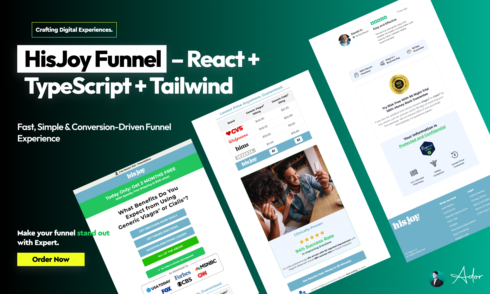

# 🛍️ HisJoy – E-Commerce Funnel Application

*A responsive, animated multi-page funnel crafted to streamline user interaction and drive conversions.*

**HisJoy** is a conversion-focused e-commerce funnel built with **React**, **TypeScript**, and **Tailwind CSS**. It guides users smoothly from product discovery to checkout while keeping the experience lightweight, fast, and backend-free. The app integrates **JotForm** for dynamic form handling, uses **Framer Motion** for elegant transitions, and supports mobile-first design out of the box.

> This project is tailored for modern product funnels where simplicity, performance, and clarity are key.

---

## 🔗 Live Preview

👉 **[Visit HisJoy Funnel](https://hisjoy.com/erectile-dysfunction-v2-ED/)**

---

## Features

✔️ **Dynamic Routing** – Seamless page transitions using React Router  
✔️ **JotForm Integration (No Backend)** – Captures and auto-fills user data through URL parameters  
✔️ **Cost Comparison Chart** – Responsive and conditionally rendered pricing layout  
✔️ **Responsive & Animated UI** – Built with Tailwind CSS and Framer Motion  
✔️ **Sticky CTA Button** – Keeps the order button visible to drive conversions

---

## Development Highlights

### 🔐 JotForm Integration Without Backend  
Integrated JotForm directly into the frontend using hidden fields and URL query parameters to auto-fill user data like name, phone, and email—removing the need for a traditional backend.

### 📦 State Preservation Across Pages  
Used React Router’s `useLocation` and `useSearchParams` to maintain user data across navigation, ensuring a seamless funnel flow from treatment selection to order confirmation.

### 📊 Conditional Rendering & UX Optimization  
Built a responsive cost comparison chart that adapts based on screen size and user selection, improving clarity and decision-making on both desktop and mobile.

---

## 🛠 Tech Stack

| Category         | Tools Used                     |
|------------------|--------------------------------|
| **Framework**    | React                          |
| **Language**     | TypeScript                     |
| **Styling**      | Tailwind CSS                   |
| **Forms**        | JotForm                        |
| **Routing**      | React Router                   |
| **Animation**    | Framer Motion                  |
| **Hosting**      | Netlify / Vercel               |

---

## 🧑‍💻 About the Developer

Crafted with care by [Jaman Ador](https://jamanador.web.app/)  
🔗 [Connect on LinkedIn](https://www.linkedin.com/in/jamanador/)  
💼 Frontend Specialist • UI Design • Funnel Builder
